# Fashion App

A modern Flutter e-commerce application for browsing and purchasing fashion items.

## Overview

Fashion App is a full-featured mobile shopping application built with Flutter that provides an elegant user interface for browsing fashion collections, managing wishlists, and completing purchases. The app features a glassmorphic design with smooth animations and an intuitive user experience.

## 📱 App Screenshots

  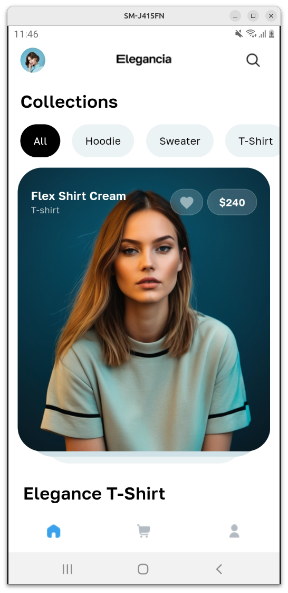
  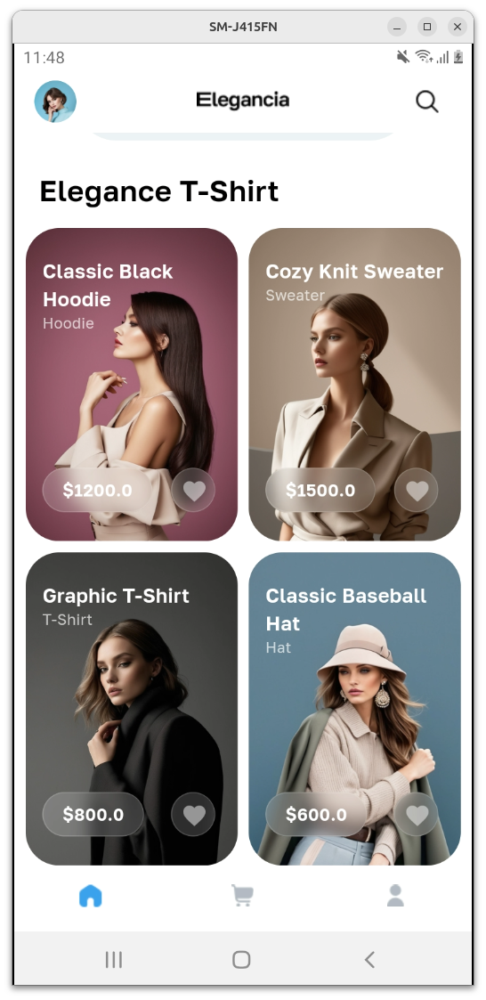
  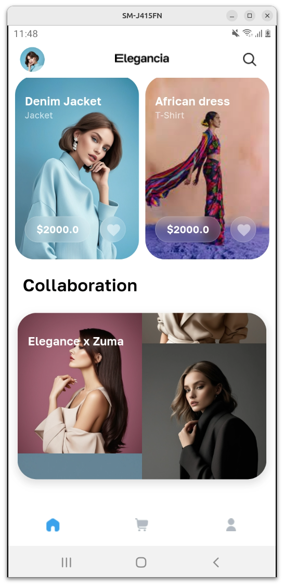

 
 

  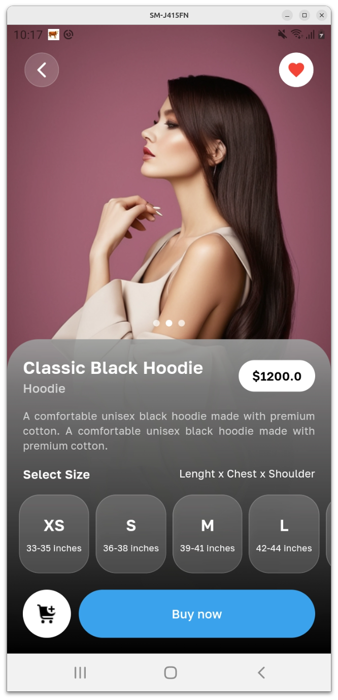
  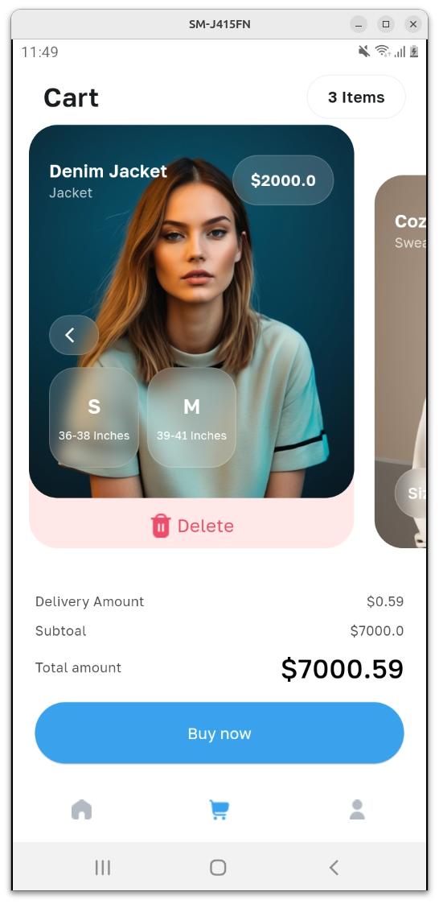
  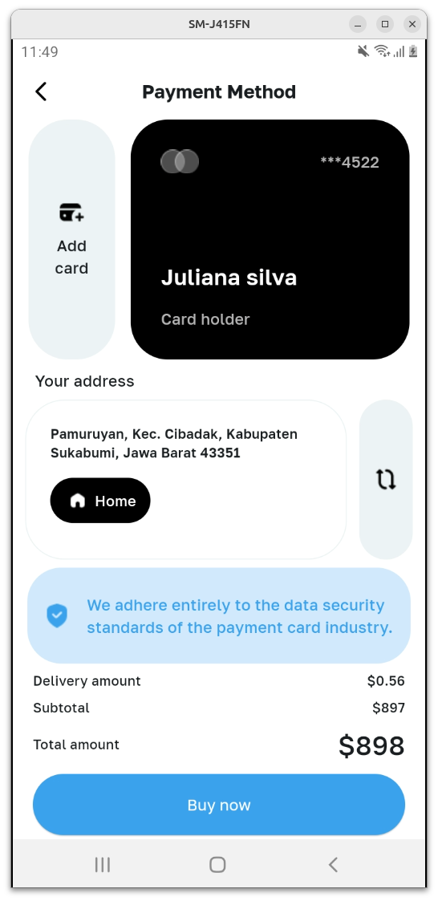

  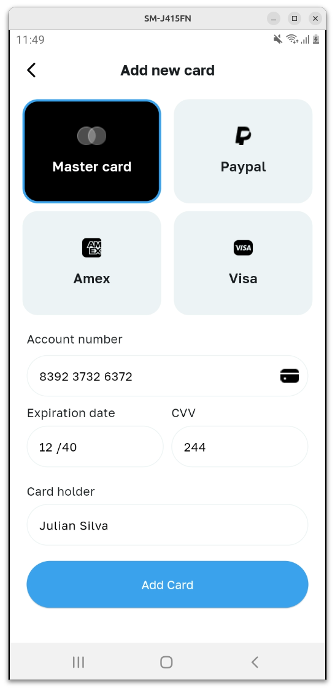
  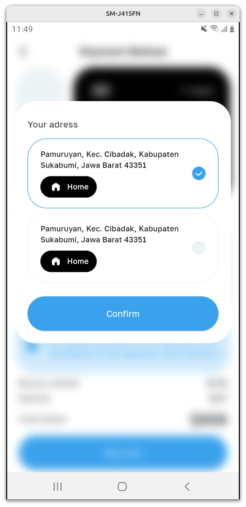
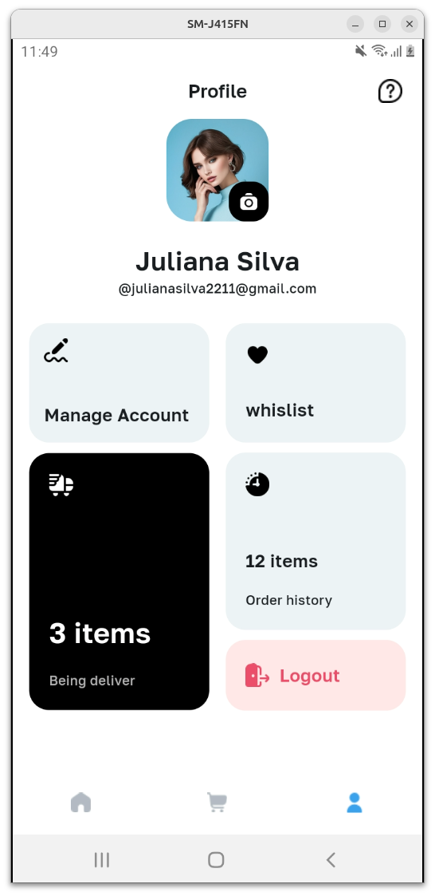

 

  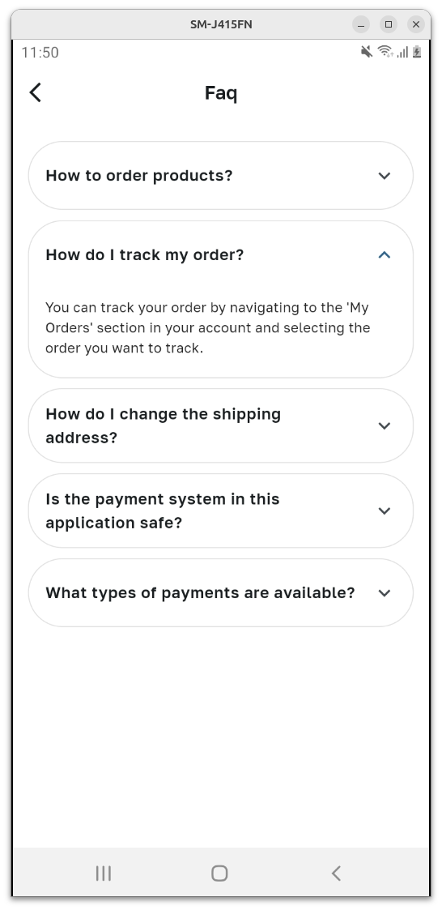
  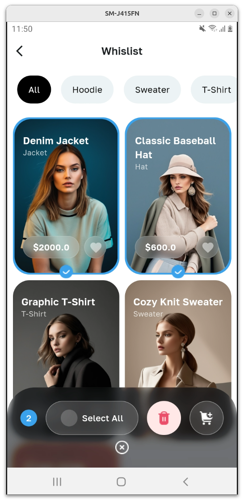

## Contributing

1. Fork the repository
2. Create a feature branch (`git checkout -b feature/amazing-feature`)
3. Commit your changes (`git commit -m 'Add amazing feature'`)
4. Push to the branch (`git push origin feature/amazing-feature`)
5. Open a Pull Request

## Support

For issues, questions, or contributions, please open an issue in the repository.

## Notes

No backend, just UI
